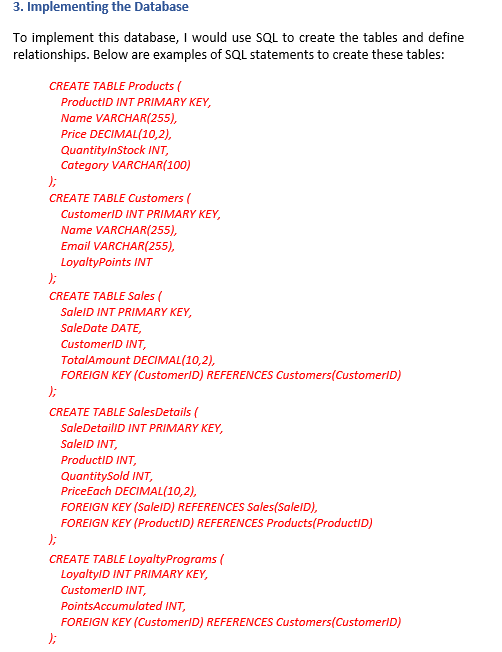
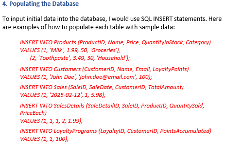

# Designing database in MySQL

## Designing a Database System for a Small Retail Business

Creating a database system for a small retail business requires careful planning to ensure that it meets the operational needs of managing inventory, sales, and customer information. The goal is to design a system that not only stores relevant data but also allows users to efficiently retrieve and update that data. Below, I outline the steps I would take to set up and create the database for this retail business.

## Understanding the Business Requirements

To begin, it's essential to understand the specific data the database will need to store. In a retail context, the database should track inventory, sales transactions, customer information, and loyalty program participation.

## Designing the Database Schema

To structure the database efficiently, I would create the following tables:

Products: This table will store information about the items for sale, such as name, price, and quantity.

Columns: ProductID (Primary Key), Name, Price, QuantityInStock, Category.

Sales: This table tracks each sale made, linking products and customers.

Columns: SaleID (Primary Key), SaleDate, CustomerID (Foreign Key), TotalAmount.

SalesDetails: This table captures individual items in each sale, linking sales to products.

Columns: SaleDetailID (Primary Key), SaleID (Foreign Key), ProductID (Foreign Key), QuantitySold, PriceEach.

Customers: Contains information about each customer, including loyalty program data.

Columns: CustomerID (Primary Key), Name, Email, LoyaltyPoints.

LoyaltyPrograms: This table stores information on customer loyalty programs, including points thresholds for rewards.

Columns: LoyaltyID (Primary Key), CustomerID (Foreign Key), PointsAccumulated.

